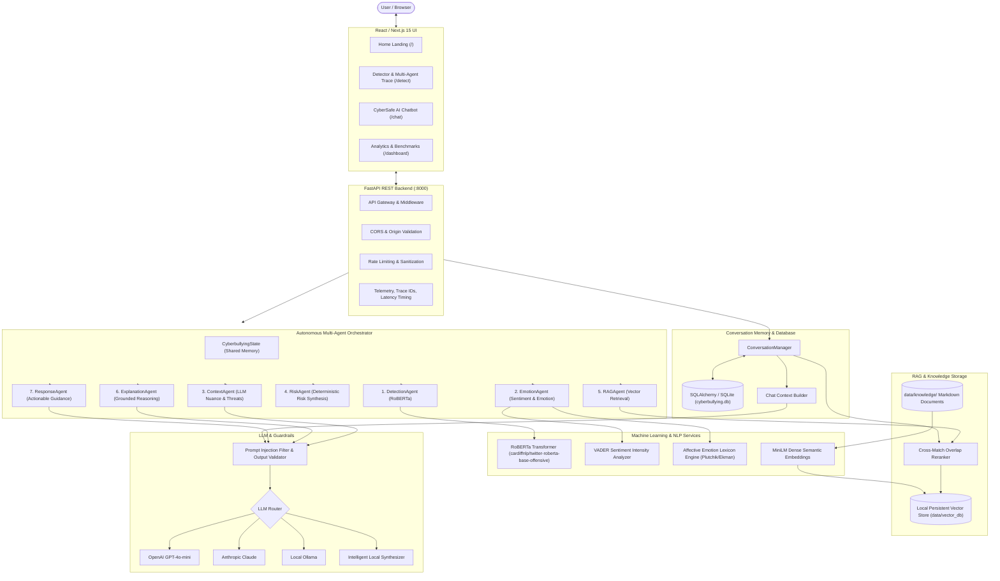

# CyberSafe AI: Complete System Architecture

CyberSafe AI is an enterprise-grade cyberbullying detection, affect analysis, explainability, and conversational safety platform. It integrates a fine-tuned RoBERTa transformer sequence classifier with affective NLP (sentiment & emotion modeling), a 7-agent autonomous orchestrator, a dense RAG knowledge retrieval engine, and an interactive AI chatbot with session memory.

---

## 1. High-Level Architecture Diagram

---

## 2. Core Subsystems

### 2.1 Detection & Affective Subsystem
- **RoBERTa Transformer**: Primary classification model running CardiffNLP twitter-roberta-base-offensive (or local fine-tuned checkpoints). Evaluates dense bidirectional representations to compute calibrated non-bullying vs cyberbullying probabilities.
- **Sentiment Service**: Extracts compound, negative, neutral, and positive polarity utilizing VADER.
- **Emotion Engine**: Projects affective markers across 5 core dimensions: Anger, Fear, Sadness, Neutral, and Joy.

### 2.2 Multi-Agent Orchestration Subsystem
Coordinates execution across 7 specialized autonomous agents using a shared structured dataclass (`CyberbullyingState`):
1. **DetectionAgent**: Invokes RoBERTa inference.
2. **EmotionAgent**: Extracts affective sentiment and fine-grained emotion vectors.
3. **ContextAgent**: Evaluates threat keywords, sarcasm, and aggression without overriding RoBERTa.
4. **RiskAgent**: Synthesizes evidence into objective tiers: `LOW`, `MEDIUM`, `HIGH`, or `CRITICAL`.
5. **RAGAgent**: Queries the persistent vector store for domain policy and intervention guidance.
6. **ExplanationAgent**: Synthesizes a factual, grounded natural language explanation of model outputs.
7. **ResponseAgent**: Formulates actionable safety protocols (block, preserve evidence, report, crisis helplines).

### 2.3 RAG Knowledge Retrieval Subsystem
- **Knowledge Categories**:
  - `cyberbullying/`: Taxonomy, behavioral indicators, severity criteria.
  - `online_safety/`: Platform-specific reporting guides (Instagram, X, Discord, TikTok, YouTube).
  - `moderation/`: Content moderation standards and escalation matrices.
  - `intervention/`: Immediate crisis response protocols and hotline numbers.
  - `prevention/`: Active bystander intervention (4Ds framework) and digital civility.
  - `research/`: RoBERTa transformer benchmarks and Federated Learning with Differential Privacy.
- **Vector Store**: High-performance persistent vector database with exact cosine similarity search over MiniLM dense embeddings and cross-attribute re-ranking.

### 2.4 Chatbot & Memory Subsystem
- **Session Memory**: Stores conversation records, messages, and analysis attachments in SQLite via SQLAlchemy.
- **Token Bounding**: Implements sliding window memory with character and message count limits.
- **Prompt Security**: Intercepts jailbreak attempts, command overrides, and leaks before reaching LLMs.
