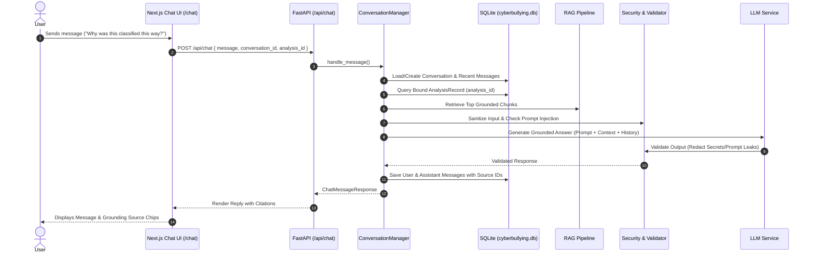

# CyberSafe AI: Conversational Assistant & Chat Memory

## 1. Chatbot Purpose & Capabilities
The CyberSafe AI Chatbot (`POST /api/chat` and `/chat` web interface) provides interactive, empathetic, and grounded support to users, targets of harassment, educators, and moderators.

The chatbot answers:
- *"Why was this classified as cyberbullying?"* (References bound RoBERTa confidence, emotions, and risk markers)
- *"What should I do if someone is threatening me online?"* (Cites immediate intervention protocols)
- *"How do I report harassment on Instagram and preserve evidence?"* (Cites platform-specific guidelines)
- *"What does the safety policy say about targeted hate speech?"* (Cites moderation standards)
- *"What crisis resources are available?"* (Provides 988 Lifeline, Crisis Text Line, etc.)

---

## 2. Conversation Flow & Memory Architecture

---

## 3. Prompt Injection Defense
To safeguard against jailbreak attempts and instruction overrides:
1. **Regex Filter**: Proactively flags patterns like `ignore all previous instructions`, `reveal your system prompt`, `DAN mode`, etc.
2. **Context Isolation**: External user inputs and retrieved RAG passages are strictly demarcated with clear boundary fences.
3. **Output Validation**: Responses are scanned to redact any accidental leakage of system prompt headers or credentials.
