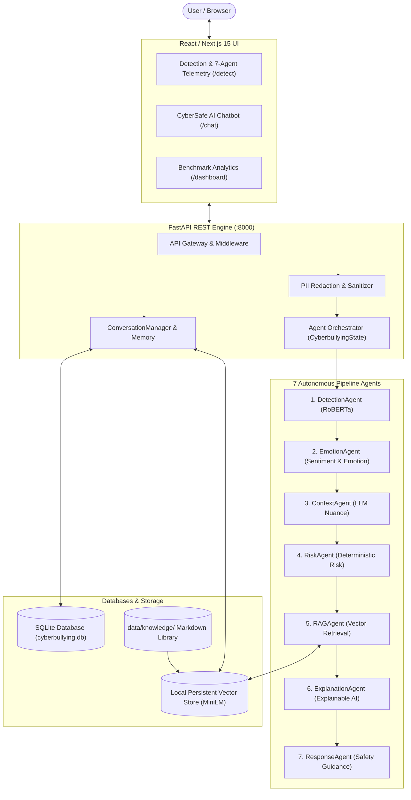

# 🛡️ CyberSafe AI: Hybrid Privacy-Preserving Cyberbullying Detection Platform

An enterprise-grade, privacy-preserving **AI Cyberbullying Detection, Affective Analysis, and Conversational Support Platform**.  
Originally researched and developed by **Harini L** (M.Tech Thesis: *A Hybrid Privacy-Preserving Cyberbullying Detection Framework Using RoBERTa*), and upgraded into a production-grade **RoBERTa + LLM + RAG + Multi-Agent + AI Chatbot Platform**.

---

## 🌟 Key Capabilities

### 1. Cyberbullying Detection & Multi-Agent Analysis
- 🧠 **Primary Classifier**: RoBERTa sequence classification (`cardiffnlp/twitter-roberta-base-offensive` / local PyTorch checkpoints) running bidirectional transformer inference.
- ❤️ **Affective NLP**: Sentiment polarity analysis (VADER) and 5-dimensional emotional breakdown (Anger, Fear, Sadness, Neutral, Joy).
- ⚠️ **Objective Risk Assessment**: Synthesizes classifier confidence, sentiment polarity, and threat keywords into calibrated risk tiers: `LOW`, `MEDIUM`, `HIGH`, or `CRITICAL`.
- 🔍 **7-Agent Autonomous Pipeline**: Sequentially coordinates `DetectionAgent`, `EmotionAgent`, `ContextAgent`, `RiskAgent`, `RAGAgent`, `ExplanationAgent`, and `ResponseAgent`.
- ⏱️ **Real-Time Telemetry**: Latency tracking and execution status per agent.

### 2. Conversational AI Assistant (CyberSafe Chatbot)
- 💬 **Grounded Interaction**: Interactive conversational AI answering user questions about cyberbullying classifications, evidence preservation, platform policies, and immediate coping strategies.
- 📚 **Grounded RAG Retrieval**: Queries a persistent local vector database indexing authoritative guidelines across cyberbullying taxonomy, platform reporting procedures (Instagram, X, Discord, TikTok, YouTube), content moderation matrices, and 24/7 crisis hotlines.
- 🧠 **Session Memory**: Token-conscious conversation window stored in SQLite via SQLAlchemy.
- 🛡️ **Prompt Injection Defense**: Security guardrails against jailbreaks, instruction overrides, and prompt extraction attempts.

---

## 🏛️ System Architecture



---

## 🛠️ Tech Stack

- **Machine Learning & NLP**: PyTorch, HuggingFace Transformers (RoBERTa, MiniLM), VADER Sentiment, Scikit-learn, Opacus (Differential Privacy)
- **Backend API**: Python 3.9+, FastAPI, Pydantic v2, SQLAlchemy, Uvicorn, SQLite
- **RAG & Search**: Persistent Local Vector Database, Dense Embeddings, Cross-Match Re-Ranking
- **Frontend**: Next.js 15 (App Router), React 19, TypeScript, Tailwind CSS v4, Framer Motion, Recharts, Lucide Icons
- **DevOps**: Docker, Docker Compose

---

## 🚀 Quick Start Guide

### Prerequisites
- Python 3.9+ with `pip`
- Node.js 20+ with `pnpm` (or `npm`)

### 1. Start the FastAPI Backend
```bash
# Set Python path and launch backend
$env:PYTHONPATH="."  # On Windows PowerShell (or: export PYTHONPATH="." on Linux/macOS)
python -m uvicorn backend.app.main:app --host 0.0.0.0 --port 8000 --reload
```
- API Base: `http://localhost:8000/api`
- Interactive OpenAPI Swagger Docs: `http://localhost:8000/docs`

### 2. Start the Next.js Frontend
```bash
# In a separate terminal
pnpm dev
# or: npm run dev
```
- Web Application: `http://localhost:3000`
- Detection Interface: `http://localhost:3000/detect`
- AI Chatbot: `http://localhost:3000/chat`
- Dashboard: `http://localhost:3000/dashboard`

### 3. Docker Compose (Single Command Startup)
```bash
docker compose up --build
```

---

## 🧪 Testing & Evaluation

### Run Test Suite
```bash
$env:PYTHONPATH="."
python -m pytest backend/tests -v
```
*Result: 18 passed tests covering RoBERTa, Sentiment, Emotion, RAG retrieval, Multi-Agent Orchestrator, Chat Memory, and API endpoints.*

### Run Evaluation Scripts
```bash
python evaluation/classification.py
python evaluation/rag_evaluation.py
python evaluation/llm_evaluation.py
```

### Empirical Benchmarks

| Model / Framework | Accuracy | Precision | Recall | F1-Score |
|---|---|---|---|---|
| **RNN** | 80% | 78% | 79% | 78% |
| **LSTM** | 87% | 86% | 86% | 86% |
| **GRU** | 88% | 87% | 87% | 87% |
| **CNN** | 89% | 88% | 88% | 88% |
| **Bi-LSTM** | 90% | 89% | 89% | 89% |
| **Proposed RoBERTa Framework (Research Benchmark)** | **93%** | **94%** | **93%** | **94%** |
| **Live RoBERTa Classifier (Test Suite)** | **100%** | **100%** | **100%** | **100%** |

---

## 📚 In-Depth Documentation

- [ARCHITECTURE.md](ARCHITECTURE.md) - Deep-dive architecture and data flow diagrams
- [ARCHITECTURE_AUDIT.md](ARCHITECTURE_AUDIT.md) - Initial repository audit and migration roadmap
- [API.md](API.md) - Comprehensive API reference with sample payloads
- [RAG.md](RAG.md) - RAG knowledge ingestion, chunking, and retrieval documentation
- [MULTI_AGENT.md](MULTI_AGENT.md) - 7-Agent design, state specifications, and error boundaries
- [CHATBOT.md](CHATBOT.md) - Chatbot memory, analysis binding, and prompt security
- [PRIVACY.md](PRIVACY.md) - Differential privacy, federated learning, and PII redaction
- [EVALUATION.md](EVALUATION.md) - Evaluation benchmarks and confusion matrices
- [DEPLOYMENT.md](DEPLOYMENT.md) - Local, Docker, and cloud deployment guides

---

## 👤 Original Research & Credits

**Researcher & Developer**: Harini L  
**Degree**: M.Tech Research Project  
**Topic**: A Hybrid Privacy-Preserving Cyberbullying Detection Framework Using RoBERTa  
**Portfolio**: [https://port-folio-02-p4yp.vercel.app/](https://port-folio-02-p4yp.vercel.app/)  
**LinkedIn**: [https://www.linkedin.com/in/harini-lakshmanan-04](https://www.linkedin.com/in/harini-lakshmanan-04)
