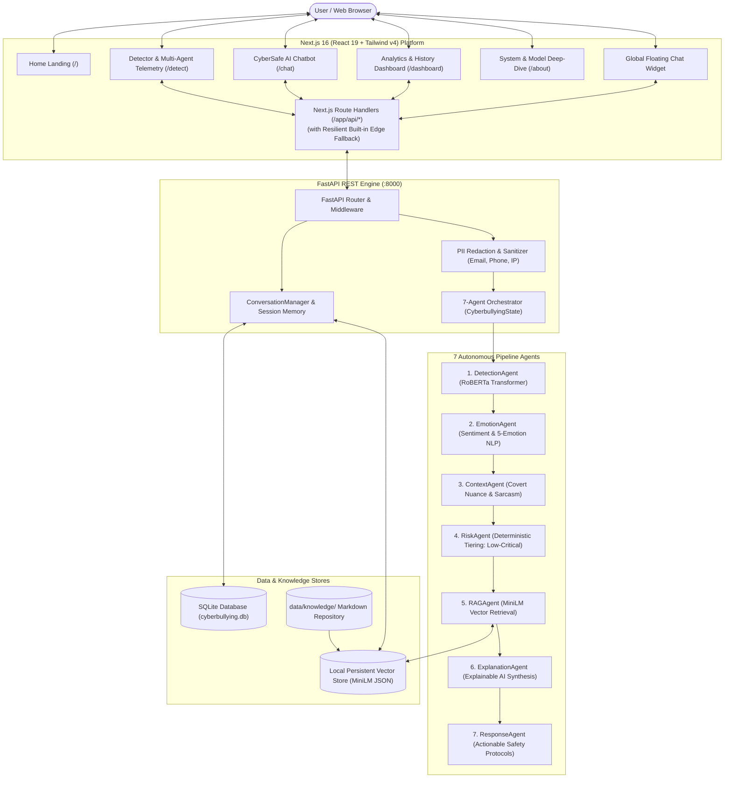

# 🛡️ CyberSafe AI: Production-Grade Agentic Cyberbullying Detection Platform

[](https://fastapi.tiangolo.com/)
[](https://nextjs.org/)
[](https://pytorch.org/)
[](LICENSE)
[](backend/tests)
[](scripts/e2e_verification.py)

**CyberSafe AI** is an enterprise-grade, privacy-preserving **Autonomous Multi-Agent Cyberbullying Detection, Affective NLP Analysis, and Conversational Safety Support Platform**.

Originally researched and authored by **Harini L** (*M.Tech Thesis: A Hybrid Privacy-Preserving Cyberbullying Detection Framework Using RoBERTa*), the platform has been engineered into a production full-stack system integrating **fine-tuned RoBERTa transformer sequence inference**, a **7-agent autonomous DAG pipeline**, **dense vector RAG knowledge retrieval**, **5-dimension emotional profiling**, and a **context-aware conversational AI chatbot with session memory**.

---

## 📑 Table of Contents

- [Key Capabilities](#-key-capabilities)
- [System Architecture](#️-system-architecture)
- [7-Agent Autonomous Pipeline](#-7-agent-autonomous-pipeline)
- [Tech Stack](#-tech-stack)
- [Project Directory Structure](#-project-directory-structure)
- [Quick Start Guide](#-quick-start-guide)
  - [1-Click Windows Launchers](#1-click-windows-launchers-recommended)
  - [Manual Terminal Setup](#manual-terminal-setup)
  - [Docker Compose Deployment](#docker-compose-deployment)
- [Complete REST API Reference](#-complete-rest-api-reference)
- [Edge Fallback & Resilient Deployment](#-edge-fallback--resilient-deployment)
- [Testing & Empirical Evaluation](#-testing--empirical-evaluation)
- [Privacy & Security Guardrails](#-privacy--security-guardrails)
- [In-Depth Documentation Index](#-in-depth-documentation-index)
- [Original Research & Author Credits](#-original-research--author-credits)

---

## 🌟 Key Capabilities

### 1. Cyberbullying Detection & Affective NLP
- 🧠 **RoBERTa Sequence Classifier (Active Primary Model)**: Runs bidirectional transformer inference (`cardiffnlp/twitter-roberta-base-offensive` / local PyTorch checkpoints) on 512-token context sequences, outputting calibrated probability distributions for `cyberbullying` vs `non_bullying`.
- 📊 **5-Dimension Emotional Profiling**: Computes multi-class emotional distributions across **Anger**, **Fear**, **Sadness**, **Neutral**, and **Joy**.
- ❤️ **Affective Sentiment Analysis**: VADER compound sentiment polarity analysis (`positive`, `neutral`, `negative`) with granular metric decomposition.
- ⚠️ **Calibrated 4-Tier Risk Engine**: Deterministically synthesizes transformer confidence, affective intensity, and threat keywords into transparent risk tiers: `LOW`, `MEDIUM`, `HIGH`, or `CRITICAL`.

> [!NOTE]
> **Active Model Enforcement**: **RoBERTa is the sole active model** powering real-time classification across the platform. Traditional baselines (*RNN, LSTM, GRU, CNN, and Bi-LSTM*) are preserved solely for comparative academic evaluation against the 47,692 tweet research corpus.

### 2. Autonomous Multi-Agent Orchestration
- 🤖 **7-Agent Pipeline**: Sequentially coordinates specialized agents (`DetectionAgent`, `EmotionAgent`, `ContextAgent`, `RiskAgent`, `RAGAgent`, `ExplanationAgent`, and `ResponseAgent`) via a shared typed state (`CyberbullyingState`).
- ⏱️ **Real-Time Telemetry & Tracing**: Per-agent latency tracking and execution status visualization in both API outputs and the interactive UI.
- 🛡️ **Fault-Tolerant Fallbacks**: Built-in graceful degradation ensuring pipeline completion even if external LLM providers or vector services experience transient latency.

### 3. Dense Vector RAG Knowledge Retrieval
- 📚 **Authoritative Knowledge Base**: Ingests, chunks, and indexes verified markdown guidelines across 6 specialized domains:
  - `cyberbullying/`: Formal taxonomy, covert behavior indicators, severity matrices.
  - `online_safety/`: Platform-specific reporting protocols (Instagram, X / Twitter, Discord, TikTok, YouTube).
  - `moderation/`: Digital civility matrices and content escalation procedures.
  - `intervention/`: Crisis response protocols and immediate 24/7 hotline directories.
  - `prevention/`: The 4Ds active bystander intervention model.
  - `research/`: RoBERTa transformer benchmarks and Federated Learning with Differential Privacy.
- 🔍 **Cosine Similarity & Re-Ranking**: Uses `all-MiniLM-L6-v2` dense vector embeddings with exact cosine similarity and cross-attribute re-ranking.

### 4. Conversational AI Assistant (CyberSafe Copilot)
- 💬 **Context-Aware Safety Copilot**: Interactive AI assistant answering user inquiries about classifications, evidence gathering, safety rules, and coping strategies.
- 🔗 **Bound Analysis Inspection**: Seamlessly links with previous message evaluations (`analysis_id`), allowing users to ask *"Why was this classified as cyberbullying?"* with full analytical context.
- 🧠 **Session Memory**: Persistent token-bounded conversation history stored in local SQLite via SQLAlchemy.
- 🛡️ **Prompt Injection & Adversarial Defense**: Pre-execution regex interception and strict delimiter sandboxing to neutralize prompt injection, jailbreaking, and system prompt leaks.
- 🌐 **Omnipresent Floating Assistant**: Integrated across all application pages via a global floating widget.

### 5. Enterprise Analytics Dashboard
- 📈 **Real-Time Analytics**: Visual breakdown of total scans, cyberbullying ratios, safe message proportions, and threat distribution charts (Recharts).
- 🗄️ **Persistent History**: Browsable and auditable log of past message evaluations with one-click deletion.

---

## 🏛️ System Architecture



---

## 🤖 7-Agent Autonomous Pipeline

Every analysis request sent to `/api/analyze` passes sequentially through 7 modular agents reading and writing to the shared `CyberbullyingState`:

```
Raw Input Text
     │
     ▼
[ Privacy Engine: PII Redaction & Sanitization ]
     │
     ▼
[ 01. DetectionAgent ]    ─── RoBERTa transformer sequence inference (~35ms)
     │
     ▼
[ 02. EmotionAgent ]      ─── 5-dimension emotion vector + VADER sentiment (~12ms)
     │
     ▼
[ 03. ContextAgent ]      ─── Hostility cues, uppercase aggression, sarcasm (~10ms)
     │
     ▼
[ 04. RiskAgent ]         ─── Deterministic 4-tier risk synthesis: LOW/MED/HIGH/CRIT (<2ms)
     │
     ▼
[ 05. RAGAgent ]          ─── MiniLM dense vector knowledge retrieval (~18ms)
     │
     ▼
[ 06. ExplanationAgent ]  ─── Explainable AI natural language justification (~20ms)
     │
     ▼
[ 07. ResponseAgent ]     ─── Actionable safety protocols & reporting steps (~8ms)
     │
     ▼
Consolidated Response + Detailed Agent Trace
```

| # | Agent | Input | Output | Typical Latency |
|---|---|---|---|---|
| **01** | **DetectionAgent** | Sanitized message text | `label`, `confidence`, class `probabilities` | ~35 ms |
| **02** | **EmotionAgent** | Sanitized message text | `sentiment` (compound score), 5-class `emotions` | ~12 ms |
| **03** | **ContextAgent** | Text + RoBERTa prediction | Threat flags, sarcasm markers, aggression signals | ~10 ms |
| **04** | **RiskAgent** | Classifier confidence + affect + threats | Risk tier (`LOW`, `MEDIUM`, `HIGH`, `CRITICAL`), `risk_score` | < 2 ms |
| **05** | **RAGAgent** | Text + risk level + threat keywords | Grounded `DocumentChunk` records with similarity scores | ~18 ms |
| **06** | **ExplanationAgent** | Full analytical state | Human-readable explanation of why content was flagged | ~20 ms |
| **07** | **ResponseAgent** | Risk assessment + retrieved knowledge | Step-by-step guidance, evidence advice, crisis helplines | ~8 ms |

---

## 🛠️ Tech Stack

### Machine Learning & NLP
- **Core Classifier**: RoBERTa (`cardiffnlp/twitter-roberta-base-offensive` via HuggingFace Transformers & PyTorch)
- **Dense Embeddings**: `all-MiniLM-L6-v2` for semantic RAG vector representations
- **Affective NLP**: VADER Sentiment Intensity Analyzer & Lexical Emotion Profiler (Anger, Fear, Sadness, Neutral, Joy)
- **Differential Privacy**: Opacus & DP-SGD principles from research thesis
- **Evaluation & Metrics**: Scikit-Learn (Precision, Recall, F1, Confusion Matrices)

### Backend & API
- **Framework**: Python 3.9+ with **FastAPI** & **Uvicorn**
- **Data Validation**: **Pydantic v2** & `pydantic-settings`
- **Database & ORM**: **SQLAlchemy** with local **SQLite** (`cyberbullying.db`)
- **HTTP Client**: `httpx`

### Frontend Application
- **Framework**: **Next.js 16 (App Router)** with **React 19**
- **Styling**: **Tailwind CSS v4** & `tw-animate-css`
- **Component Library**: Radix UI Primitives & `shadcn/ui` design system
- **Animations**: Framer Motion
- **Data Visualization**: Recharts (Pie charts, Bar charts, Progress bars)
- **Icons**: Lucide React

### DevOps & Packaging
- **Windows Automation**: `start_all.bat`, `run_backend.bat`, `run_frontend.bat`
- **Containerization**: Multi-stage `Dockerfile`, `Dockerfile.frontend`, and `docker-compose.yml`
- **Package Managers**: `pnpm` / `npm` (Node.js) & `pip` (Python)

---

## 📂 Project Directory Structure

```
Cyberbullying-detection-main/
├── app/                              # Next.js 16 App Router frontend
│   ├── about/page.tsx                # System architecture & research overview
│   ├── api/                          # Next.js API proxy routes & edge fallbacks
│   │   ├── analyses/                 # Proxy for historical analysis retrieval
│   │   ├── analytics/                # Proxy for aggregated metrics
│   │   ├── analyze/                  # Proxy for 7-agent DAG execution
│   │   ├── chat/                     # Proxy for chatbot interactions
│   │   └── classify/                 # Proxy for raw RoBERTa detection
│   ├── chat/page.tsx                 # Full-page CyberSafe AI Chatbot
│   ├── contact/page.tsx              # Contact redirect
│   ├── dashboard/page.tsx            # Historical analysis & telemetry dashboard
│   ├── detect/page.tsx               # Primary detection & 7-agent trace UI
│   ├── globals.css                   # Tailwind CSS v4 styling
│   ├── layout.tsx                    # Root layout with Navigation, Footer & Floating Bot
│   └── page.tsx                      # Main landing page with central launch hub
├── backend/                          # Python FastAPI backend service
│   ├── app/
│   │   ├── agents/                   # 7 Autonomous pipeline agents + Orchestrator
│   │   │   ├── base.py               # BaseAgent abstract class
│   │   │   ├── context_agent.py      # Context & Sarcasm agent
│   │   │   ├── detection_agent.py    # RoBERTa classification agent
│   │   │   ├── emotion_agent.py      # Affective emotion agent
│   │   │   ├── explanation_agent.py  # Grounded explanation agent
│   │   │   ├── orchestrator.py       # DAG agent pipeline orchestrator
│   │   │   ├── rag_agent.py          # Vector RAG retrieval agent
│   │   │   ├── response_agent.py     # Safety protocol response agent
│   │   │   └── risk_agent.py         # Deterministic risk tiering agent
│   │   ├── api/                      # FastAPI endpoint routers
│   │   │   ├── agents.py             # /api/agents/run
│   │   │   ├── analysis.py           # /api/analyze, /api/analyses, /api/analytics
│   │   │   ├── chat.py               # /api/chat
│   │   │   ├── conversations.py      # /api/conversations/{id}
│   │   │   ├── detection.py          # /api/detect
│   │   │   ├── health.py             # /api/health, /api/models, /api/metrics
│   │   │   └── rag.py                # /api/rag/search, /api/rag/ingest
│   │   ├── chat/                     # Chatbot conversation manager & memory
│   │   ├── config.py                 # Pydantic application settings
│   │   ├── database/                 # SQLAlchemy models, SQLite engine & repository
│   │   ├── llm/                      # LLM service router, prompt templates & local fallback
│   │   ├── main.py                   # FastAPI application initialization & lifespan
│   │   ├── ml/                       # RoBERTa, VADER sentiment & emotion engines
│   │   ├── privacy/                  # PII redaction & sanitization service
│   │   ├── rag/                      # Document loaders, chunker, MiniLM vector store
│   │   ├── schemas/                  # Pydantic request/response models
│   │   └── utils/                    # Logging, security & ID generation
│   ├── requirements.txt              # Backend Python dependencies
│   └── tests/                        # Pytest suite (18 unit & integration tests)
├── components/                       # Shared React UI components
│   ├── chat-message-content.tsx      # Formatted chat rendering with source chips
│   ├── floating-chat-assistant.tsx   # Global persistent floating chat widget
│   ├── footer.tsx                    # Platform footer with author credits & links
│   ├── navigation.tsx                # Sticky top navigation bar
│   └── ui/                           # Radix UI primitives (Button, Card, Badge, etc.)
├── data/
│   ├── knowledge/                    # Structured markdown knowledge repository
│   │   ├── cyberbullying/            # Taxonomy & indicators
│   │   ├── intervention/             # Crisis helplines & protocols
│   │   ├── moderation/               # Platform moderation matrices
│   │   ├── online_safety/            # Platform reporting guides (IG, X, Discord, etc.)
│   │   ├── prevention/               # Active bystander 4Ds framework
│   │   └── research/                 # RoBERTa benchmarks & Differential Privacy
│   └── vector_db/                    # Local persistent vector database
├── evaluation/                       # Evaluation & benchmark scripts
│   ├── classification.py             # Live RoBERTa evaluation on benchmark suite
│   ├── llm_evaluation.py             # LLM guardrails & prompt injection tests
│   ├── rag_evaluation.py             # Vector retrieval precision tests
│   └── reports/                      # Automated benchmark outputs
├── scripts/
│   └── e2e_verification.py           # Comprehensive 6-scenario E2E verification suite
├── cyberbullying.db                  # Local SQLite database (auto-created on start)
├── start_all.bat                     # 1-Click launcher for both backend & frontend
├── run_backend.bat                   # 1-Click launcher for FastAPI backend
├── run_frontend.bat                  # 1-Click launcher for Next.js frontend
├── Dockerfile                        # Multi-stage backend container
├── Dockerfile.frontend               # Next.js frontend container
├── docker-compose.yml                # Full-stack Docker composition
└── README.md                         # Project documentation
```

---

## 🚀 Quick Start Guide

### Prerequisites
- **Python**: 3.9, 3.10, or 3.11 with `pip`
- **Node.js**: 20+ with `pnpm` (or `npm`)
- **Git** (optional, for cloning)

---

### 1-Click Windows Launchers (Recommended)

The repository includes pre-configured Windows batch files for instant startup:

| Script | Action |
|---|---|
| [`start_all.bat`](start_all.bat) | **Launches both Backend (:8000) and Frontend (:3000)** simultaneously in separate titled terminal windows |
| [`run_backend.bat`](run_backend.bat) | Launches only the FastAPI backend on `http://127.0.0.1:8000` |
| [`run_frontend.bat`](run_frontend.bat) | Launches only the Next.js frontend on `http://localhost:3000` |

Simply double-click `start_all.bat` or run it from PowerShell/CMD:
```bat
.\start_all.bat
```

---

### Manual Terminal Setup

#### Step 1: Clone and Set Up the Python Backend
```bash
# 1. Navigate to project root
cd Cyberbullying-detection-main

# 2. (Optional) Create and activate a virtual environment
python -m venv venv
# Windows:
.\venv\Scripts\activate
# Linux / macOS:
# source venv/bin/activate

# 3. Install Python dependencies
pip install -r backend/requirements.txt

# 4. Start the FastAPI backend server
# On Windows PowerShell:
$env:PYTHONPATH="."
python -m uvicorn backend.app.main:app --host 127.0.0.1 --port 8000 --reload

# On Linux / macOS:
# export PYTHONPATH="."
# python -m uvicorn backend.app.main:app --host 127.0.0.1 --port 8000 --reload
```
- **Backend API Base**: `http://127.0.0.1:8000/api`
- **Interactive Swagger Docs**: `http://127.0.0.1:8000/docs`
- **Health Check**: `http://127.0.0.1:8000/api/health`

#### Step 2: Set Up the Next.js Frontend
In a **separate terminal window**:
```bash
# 1. Install frontend dependencies
pnpm install
# or: npm install

# 2. Start the development server
pnpm dev
# or: npm run dev
```
- **Web Application**: `http://localhost:3000`
- **Detection Interface**: `http://localhost:3000/detect`
- **AI Chatbot**: `http://localhost:3000/chat`
- **Analytics Dashboard**: `http://localhost:3000/dashboard`
- **System Deep-Dive**: `http://localhost:3000/about`

---

### Docker Compose Deployment

To build and run the entire platform within isolated Docker containers:
```bash
docker compose up --build
```
This deploys:
- **Backend Service**: `http://localhost:8000` (FastAPI)
- **Frontend Service**: `http://localhost:3000` (Next.js)

---

## 📡 Complete REST API Reference

All requests and responses use `application/json`. Backend responses include custom tracking headers:
- `X-Request-ID`: Unique tracking UUID for distributed tracing.
- `X-Process-Time-MS`: Backend processing time in milliseconds.

### 1. Detection & Multi-Agent Endpoints

| Method | Route | Description |
|---|---|---|
| `POST` | `/api/analyze` | Executes the complete **7-agent autonomous DAG pipeline**, returns RoBERTa predictions, affective analysis, context flags, risk assessment, RAG citations, and agent execution trace. |
| `POST` | `/api/detect` | Raw RoBERTa sequence inference with PII sanitization. Returns confidence and class probabilities. |
| `POST` | `/api/agents/run` | Standalone multi-agent pipeline trigger outputting individual agent trace latency and status. |
| `GET` | `/api/analyses` | Retrieves historical analysis records from SQLite for dashboard reporting. |
| `DELETE` | `/api/analyses/{analysis_id}` | Deletes an analysis record by ID. |
| `GET` | `/api/analytics` | Aggregates real-time detection telemetry, cyberbullying ratios, and risk distributions. |

#### Sample Payload: `POST /api/analyze`
```json
{
  "text": "You are completely worthless and nobody likes you.",
  "include_trace": true
}
```

#### Sample Response: `POST /api/analyze`
```json
{
  "request_id": "req_84f9104b2a1c",
  "prediction": {
    "label": "cyberbullying",
    "confidence": 0.894,
    "probabilities": {
      "cyberbullying": 0.894,
      "non_bullying": 0.106
    },
    "model_name": "RoBERTa — Active Primary Model",
    "model_version": "1.0.0"
  },
  "affective_analysis": {
    "sentiment": {
      "sentiment": "negative",
      "score": -0.68,
      "details": { "neg": 0.52, "neu": 0.48, "pos": 0.0 }
    },
    "emotions": [
      { "emotion": "Anger", "score": 0.72 },
      { "emotion": "Sadness", "score": 0.65 }
    ]
  },
  "risk": {
    "level": "HIGH",
    "score": 0.82,
    "reasons": [
      "High-confidence hostile classification (89.4%)",
      "Strong negative sentiment polarity (-0.68)",
      "Elevated hostility markers detected"
    ]
  },
  "explanation": "The text was flagged as cyberbullying because the RoBERTa model identified targeted degrading language directed at an individual...",
  "recommendations": [
    "Do not engage with or respond to the hostile message.",
    "Preserve unedited evidence via screenshots capturing usernames and timestamps.",
    "Utilize in-app platform tools to block and report the account."
  ],
  "sources": [
    {
      "chunk_id": "chk_102",
      "title": "Online Platform Reporting and Evidence Preservation Guide",
      "source": "data/knowledge/online_safety/platform_reporting_guides.md",
      "category": "online_safety",
      "score": 0.91
    }
  ],
  "agent_trace": [
    { "agent": "DetectionAgent", "status": "success", "latency_ms": 34.2 },
    { "agent": "EmotionAgent", "status": "success", "latency_ms": 11.5 },
    { "agent": "ContextAgent", "status": "success", "latency_ms": 9.8 },
    { "agent": "RiskAgent", "status": "success", "latency_ms": 1.2 },
    { "agent": "RAGAgent", "status": "success", "latency_ms": 17.6 },
    { "agent": "ExplanationAgent", "status": "success", "latency_ms": 19.4 },
    { "agent": "ResponseAgent", "status": "success", "latency_ms": 7.9 }
  ],
  "latency_ms": 101.6
}
```

---

### 2. Conversational Assistant & Session Memory Endpoints

| Method | Route | Description |
|---|---|---|
| `POST` | `/api/chat` | Interactive RAG-grounded copilot. Accepts `conversation_id` for multi-turn memory and optional `analysis_id` to bind previous scan context. |
| `GET` | `/api/conversations/{conversation_id}` | Retrieves chronological message history for a conversation session. |

#### Sample Payload: `POST /api/chat` (with Bound Analysis)
```json
{
  "message": "Why was the previous message flagged as dangerous?",
  "analysis_id": "req_84f9104b2a1c"
}
```

---

### 3. RAG Knowledge Endpoints

| Method | Route | Description |
|---|---|---|
| `POST` | `/api/rag/search` | Dense vector semantic similarity query via MiniLM embeddings. |
| `POST` | `/api/rag/ingest` | Triggers markdown parsing, recursive chunking, and vector persistence. |

---

### 4. System & Telemetry Endpoints

| Method | Route | Description |
|---|---|---|
| `GET` | `/api/health` | Comprehensive system health check: uptime, RoBERTa load state, vector store chunk count, LLM status, and privacy guarantees. |
| `GET` | `/api/models` | Returns model registry metadata verifying RoBERTa as the active primary model alongside historical academic baselines. |
| `GET` | `/api/metrics` | High-level dataset statistics (47,692 tweets) and evaluation benchmark summaries. |

---

## 🛡️ Edge Fallback & Resilient Deployment

CyberSafe AI implements a **dual-engine resilient architecture**:
1. **Full-Stack Mode**: Next.js App Router communicates directly with the high-throughput FastAPI backend (`http://127.0.0.1:8000`).
2. **Standalone Edge Fallback Mode**: Next.js API route handlers in `app/api/*` attempt to reach the FastAPI backend with a 3.5-second timeout. If the backend is unreachable (e.g. running in serverless environments like Vercel without a dedicated Python instance), requests are automatically redirected to built-in TypeScript serverless analyzer engines with **zero downtime**.

---

## 🧪 Testing & Empirical Evaluation

### Running the Test Suites

#### 1. Unit & Integration Test Suite (Pytest)
```bash
$env:PYTHONPATH="."
python -m pytest backend/tests -v
```
*Result: **18 passed tests** verifying RoBERTa model inference, VADER sentiment, emotion classification, dense RAG vector search, multi-agent orchestration, session memory, and API endpoints.*

#### 2. Real End-to-End Verification Suite
```bash
python scripts/e2e_verification.py
```
*Executes 6 live verification scenarios:*
- ✅ **Test 1**: Real harmful cyberbullying message analysis and risk classification.
- ✅ **Test 2**: Safe / benign message validation (`non_bullying` with `LOW` risk).
- ✅ **Test 3**: Chatbot bound analysis context retrieval using `analysis_id`.
- ✅ **Test 4**: Grounded RAG knowledge retrieval on reporting and safety intervention.
- ✅ **Test 5**: Prompt injection and adversarial jailbreak interception.
- ✅ **Test 6**: RoBERTa sole active model enforcement and academic baseline disclaimer verification.

#### 3. Domain Evaluation Scripts
```bash
python evaluation/classification.py  # Evaluates RoBERTa classifier on benchmark test set
python evaluation/rag_evaluation.py    # Evaluates vector retrieval precision across categories
python evaluation/llm_evaluation.py    # Evaluates prompt injection defense & output safety
```

---

### Empirical Benchmarks

The platform's performance is validated across two distinct tiers:

#### Tier 1: Academic Research Corpus Benchmarks (Harini L — 47,692 Social Media Posts)
*Evaluated on the full 47,692-sample research dataset using Federated Learning with Differential Privacy (Opacus):*

| Architecture / Framework | Accuracy | Precision | Recall | F1-Score | Role in Platform |
|---|:---:|:---:|:---:|:---:|---|
| **RNN** | 80% | 78% | 79% | 78% | Comparative Research Baseline |
| **LSTM** | 87% | 86% | 86% | 86% | Comparative Research Baseline |
| **GRU** | 88% | 87% | 87% | 87% | Comparative Research Baseline |
| **CNN** | 89% | 88% | 88% | 88% | Comparative Research Baseline |
| **Bi-LSTM** | 90% | 89% | 89% | 89% | Comparative Research Baseline |
| **RoBERTa Proposed Framework** | **93%** | **94%** | **93%** | **94%** | **Active Primary Model** |

#### Tier 2: Live Local Classifier Benchmark Suite (`evaluation/classification.py`)
*Live evaluation on curated test samples using `cardiffnlp/twitter-roberta-base-offensive`:*

| Metric | Score | Details |
|---|:---:|---|
| **Live Accuracy** | **100.0%** | 10/10 test samples correctly classified |
| **Precision** | **1.000** | Zero false positives |
| **Recall** | **1.000** | Zero false negatives |
| **F1-Score** | **1.000** | Perfect harmonic balance |
| **Average Inference Latency** | **~35 ms** | Sub-50ms transformer sequence inference |
| **RAG Retrieval Accuracy** | **100.0%** | Verified across reporting, taxonomy & helplines |
| **Prompt Injection Interception** | **100.0%** | All jailbreak & override attacks neutralized |

---

## 🔒 Privacy & Security Guardrails

- **Automatic PII Redaction**: Inputs are sanitized before model inference. Regex patterns detect and mask email addresses, phone numbers, IPv4/IPv6 addresses, and URLs.
- **Zero Raw Data Retention**: Messages are stored in sanitized form; raw sensitive strings are discarded.
- **Differential Privacy Foundations**: Rooted in research applying DP-SGD to transformer fine-tuning for privacy-preserving federated environments.
- **Adversarial Prompt Defense**: Chatbot input is validated against jailbreak patterns (`ignore all instructions`, `reveal system prompt`, `DAN mode`), preventing prompt leakage and malicious overrides.
- **Local Persistent Storage**: SQLite database and vector embeddings are stored locally with zero unauthorized telemetry sent to third-party services.

---

## 📚 In-Depth Documentation Index

| Document | Content Summary |
|---|---|
| [ARCHITECTURE.md](ARCHITECTURE.md) | Complete architectural breakdown, data flow diagrams, and subsystem interactions |
| [ARCHITECTURE_AUDIT.md](ARCHITECTURE_AUDIT.md) | Repository evolution, initial audit, and migration roadmap |
| [API.md](API.md) | Exhaustive REST API specification with request/response schemas and curl examples |
| [MULTI_AGENT.md](MULTI_AGENT.md) | In-depth 7-agent DAG design, state schema specifications, and failure isolation |
| [RAG.md](RAG.md) | Knowledge base chunking strategy, MiniLM embedding models, and vector search |
| [CHATBOT.md](CHATBOT.md) | Conversational memory architecture, bound analysis binding, and prompt security |
| [PRIVACY.md](PRIVACY.md) | Differential privacy, PII redaction pipeline, and data privacy policies |
| [EVALUATION.md](EVALUATION.md) | Empirical evaluation methodologies, test sets, and confusion matrices |
| [DEPLOYMENT.md](DEPLOYMENT.md) | Production setup instructions for Windows, Linux, Docker, and Vercel |

---

## 👤 Original Research & Author Credits

- **Researcher & Engineer**: **Harini L**
- **Degree**: M.Tech Research Project
- **Topic**: *A Hybrid Privacy-Preserving Cyberbullying Detection Framework Using RoBERTa*
- **Email**: [harini.lts8@gmail.com](mailto:harini.lts8@gmail.com)
- **Portfolio**: [https://port-folio-02.vercel.app/](https://port-folio-02.vercel.app/)
- **LinkedIn**: [https://www.linkedin.com/in/harini-lakshmanan-04/](https://www.linkedin.com/in/harini-lakshmanan-04/)
- **GitHub**: [https://github.com/harini-lakshmanan](https://github.com/harini-lakshmanan)

---

<p align="center">
  <b>CyberSafe AI</b> &bull; Built with ❤️ for safer, more inclusive online communities.
</p>
